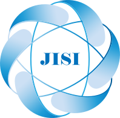
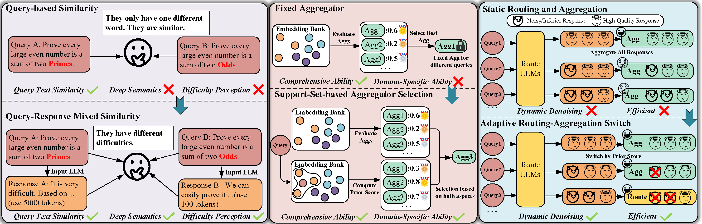
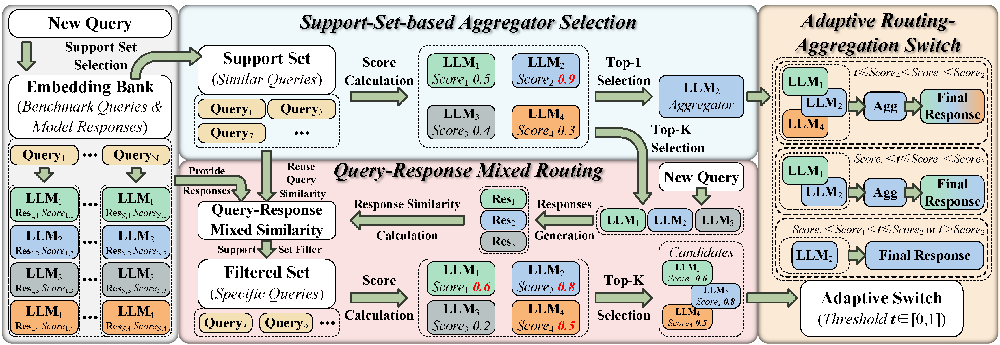
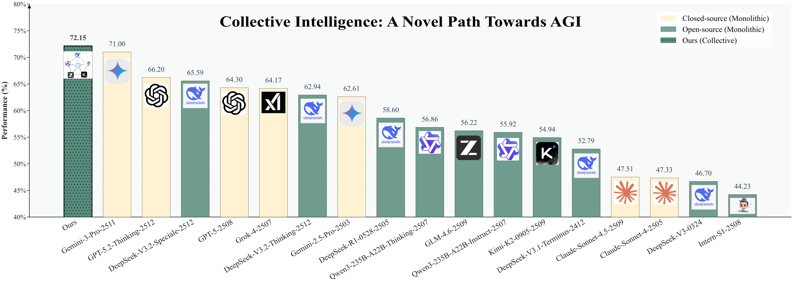
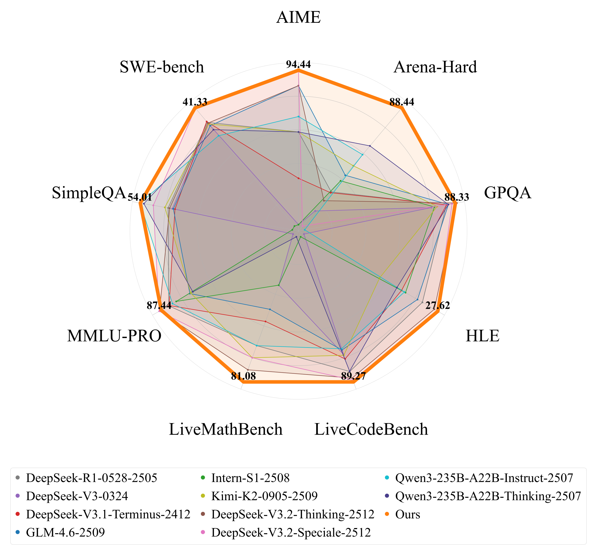
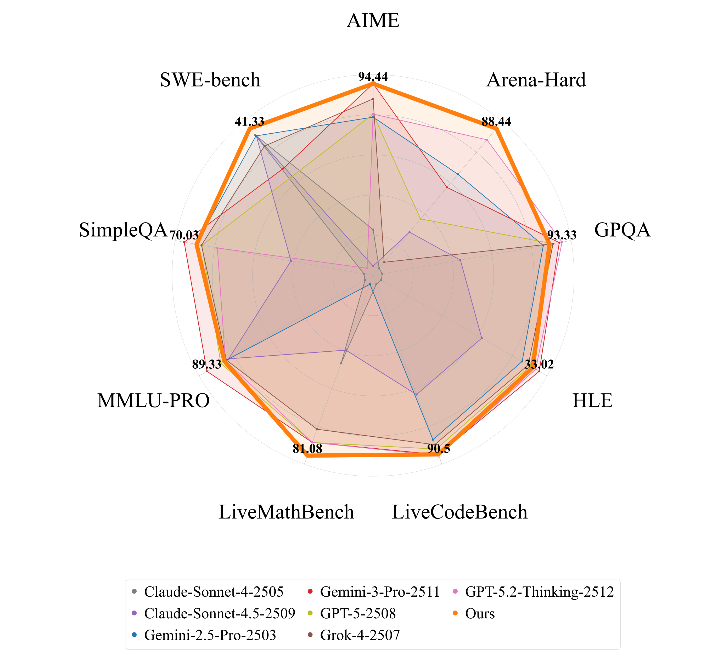
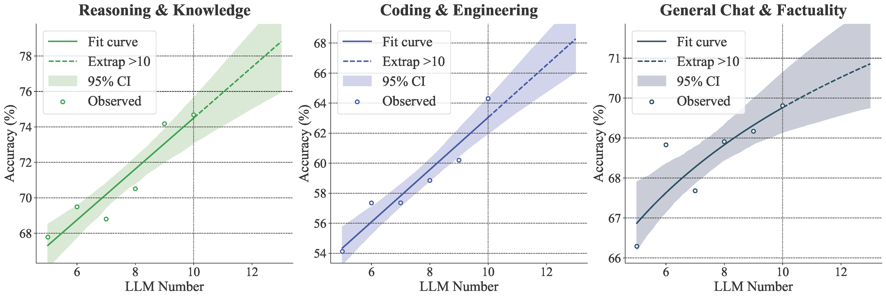

<div align="center">


# JiSi: Collective Intelligence for LLM Collaboration

[](https://arxiv.org/abs/2601.01330)
[](LICENSE)

**Beyond Gemini-3-Pro: Revisiting LLM Routing and Aggregation at Scale**

*Orchestrating open-source LLMs to surpass proprietary giants through collective intelligence*

[🏗️ Architecture](#️-architecture) • [📊 Results](#-performance) • [📚 Citation](#-citation)

</div>

## 🎯 Overview

> *Is indefinite scaling of a single "super model" the only path toward AGI?*

### Our Solution: JiSi Framework

**JiSi** (named after a Chinese idiom for collective intelligence) proposes an alternative path: **orchestrating multiple open-source LLMs to collaborate synergistically**, achieving superior performance at a fraction of the cost.

By uniting ten current open-source LLMs through intelligent routing and adaptive aggregation, JiSi demonstrates that **collective intelligence** can surpass even the most powerful proprietary models.

### Key Achievements

| Metric | JiSi | Gemini-3-Pro | Improvement |
|--------|------|--------------|-------------|
| **Average Performance** | **72.15%** | 71.00% | **+1.15%** ⬆️ |
| **Total Cost** | **$63.36** | $135.46 | **53.23% savings** 💰 |

### Why It Matters

- 🚀 **Performance**: Surpasses all monolithic LLMs (open-source and proprietary)
- 💰 **Efficiency**: 53% cost reduction vs. Gemini-3-Pro
- 📈 **Scalability**: Consistent improvement as more LLMs are added
- 🔓 **Open**: Built on transparent, community-driven models
- 🎯 **Practical**: Training-free, easy to deploy, production-ready

## 🏗️ Architecture

JiSi adopts a minimalist **"route-and-aggregate"** topology with three core technical innovations:

*Figure: JiSi rethinks the existing routing and aggregation methods, and reshapes them from three aspects: 1) **Routing**: from query-based to query-response-mixed; 2) **Aggregation**: from fixed aggregator to support-set-based aggregator selection; 3) **Combination**: from static routing and aggregation to adaptive routing-aggregation switch. For simplicity, the "Agg" means Aggregator or Aggregation.*



*Figure: JiSi framework architecture. Based on a pre-built embedding bank, JiSi performs three key operations: (1) Support-Set-based Aggregator Selection, (2) Query-Response Mixed Routing, and (3) Adaptive Routing-Aggregation Switch.*

## 📊 Performance

### Overall Leaderboard



*Figure: JiSi surpasses all monolithic LLMs, including leading closed-source models like Gemini-3-Pro, GPT-5.2-Thinking, and Grok-4.*

### Comprehensive Comparison

<p align="center">
  
  
</p>

<p align="center">
  <em>Figure: Fine-grained capability comparison across (left) open-source LLMs and (right) closed-source LLMs. JiSi achieves superior or competitive performance across all benchmarks.</em>
</p>

### Scalability Analysis



*Figure: JiSi demonstrates consistent performance improvement as more open-source LLMs are added (5 → 10 models), validating a new "scaling law of collaboration".*

## 📚 Citation

If you find JiSi useful in your research, please cite:

```bibtex
@misc{tang2026gemini3prorevisitingllmrouting,
      title={Beyond Gemini-3-Pro: Revisiting LLM Routing and Aggregation at Scale}, 
      author={Shengji Tang and Weihao Lin and Jingqi Ye and Hao Li and Bo Zhang and Shuyue Hu and Tao Chen and Wangli Ouyang and Lei Bai and Peng Ye},
      year={2026},
      eprint={2601.01330},
      archivePrefix={arXiv},
      primaryClass={cs.AI},
      url={https://arxiv.org/abs/2601.01330}, 
}
```

---

<div align="center">

*Collective intelligence represents a novel path toward AGI*

[⬆ Back to Top](#jisi-collective-intelligence-for-llm-collaboration)

</div>
