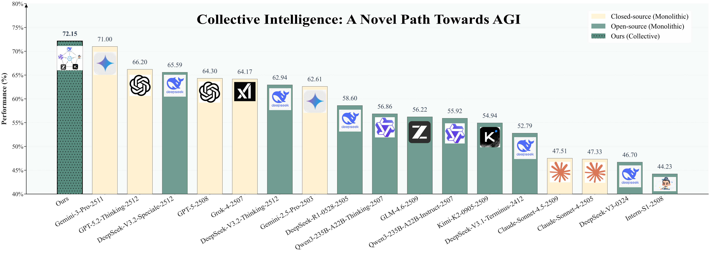
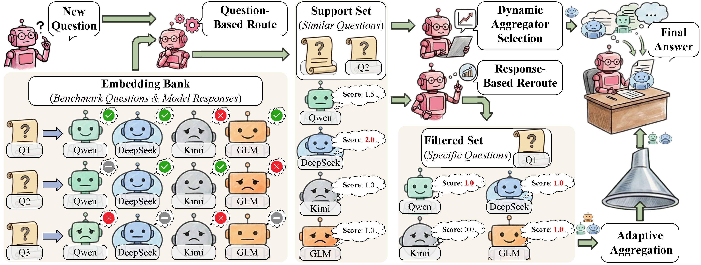
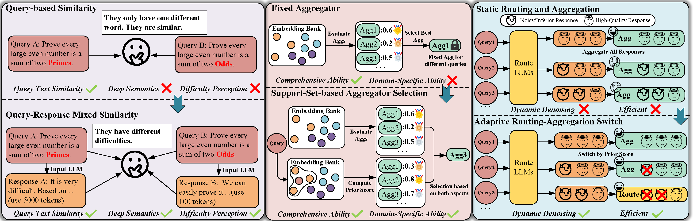
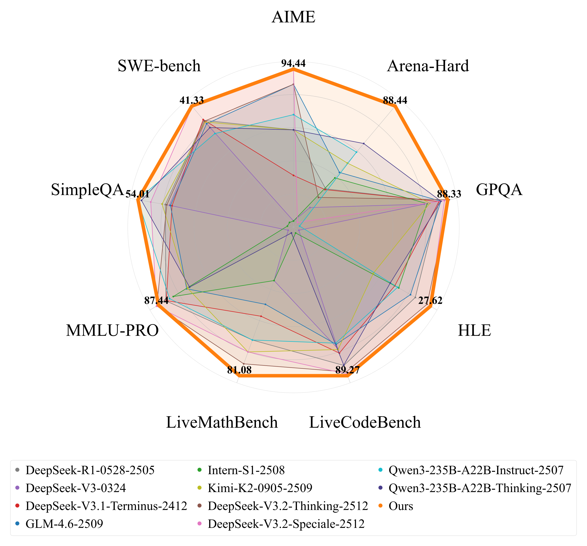
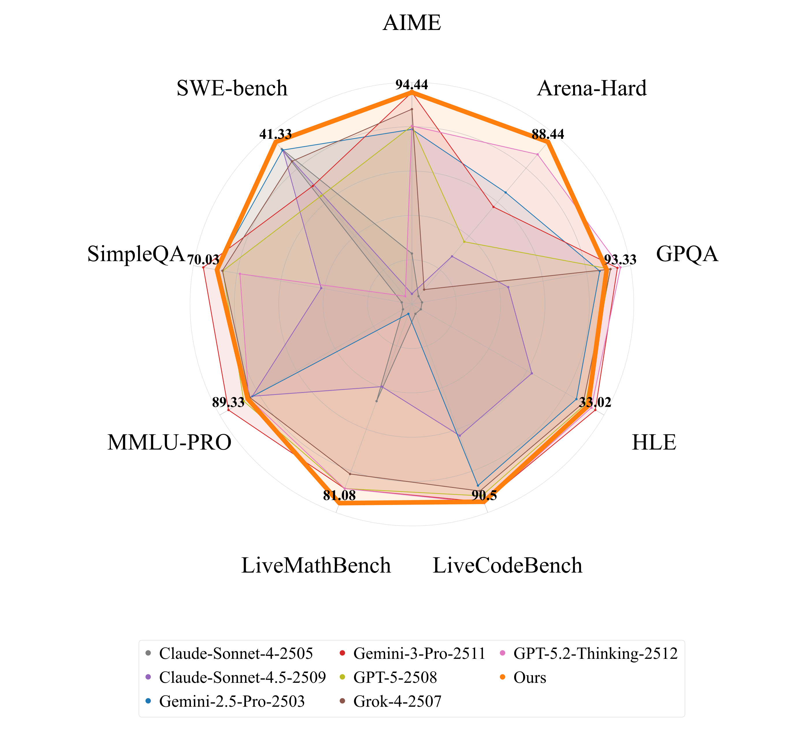
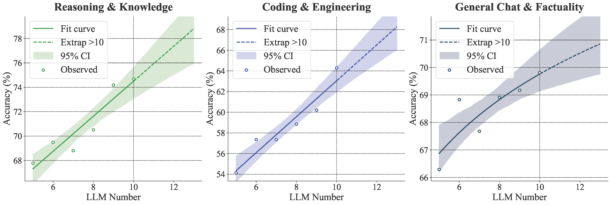

<h1 align="center">
  
  JiSi: Revisiting LLM Routing and Aggregation at Scale
</h1>

<p align="center" style="font-size: 1.15em;">
  <strong>Your one-stop multi-LLM think tank</strong>
</p>

<p align="center">
  <a href="README.md"><strong>English</strong></a> | <a href="README-CN.md">简体中文</a>
</p>

<p align="center">
  <a href="https://scholar.google.com/citations?user=K7drMDgAAAAJ">Shengji Tang</a><sup>1,2,*</sup> &nbsp;&nbsp;
  <a href="https://scholar.google.com/citations?user=k5MQpaIAAAAJ">Weihao Lin</a><sup>1,3,*</sup> &nbsp;&nbsp;
  <a href="https://scholar.google.com/citations?user=UEZZP5QAAAAJ">Peng Ye</a><sup>1,2,†</sup> &nbsp;&nbsp;
  <a href="https://openreview.net/profile?id=~Jingqi_Ye1">Jingqi Ye</a><sup>4</sup> &nbsp;&nbsp;
  <a href="https://github.com/ynulihao">Hao Li</a><sup>1,5</sup> &nbsp;&nbsp;
  <a href="https://scholar.google.com/citations?user=63_0cG8AAAAJ">Yiqun Zhang</a><sup>1,6</sup> &nbsp;&nbsp;
  <a href="https://xiaosongwang.github.io/">Xiaosong Wang</a><sup>1</sup>
</p>

<p align="center">
  <a href="https://bobrown.github.io/boZhang.github.io/">Bo Zhang</a><sup>1</sup> &nbsp;&nbsp;
  <a href="https://shuyuehu.github.io/">Shuyue Hu</a><sup>1</sup> &nbsp;&nbsp;
  <a href="https://eetchen.github.io/">Tao Chen</a><sup>3</sup> &nbsp;&nbsp;
  <a href="https://leibai.site/">Lei Bai</a><sup>1</sup> &nbsp;&nbsp;
  <a href="https://wlouyang.github.io/">Wanli Ouyang</a><sup>1,2</sup>
</p>

<p align="center">
  <sup>1</sup>Shanghai Artificial Intelligence Laboratory &nbsp;&nbsp;
  <sup>2</sup>The Chinese University of Hong Kong &nbsp;&nbsp;
  <sup>3</sup>Fudan University
</p>

<p align="center">
  <sup>4</sup>University of Science and Technology of China &nbsp;&nbsp;
  <sup>5</sup>Northwestern Polytechnical University &nbsp;&nbsp;
  <sup>6</sup>Northeastern University
</p>

<p align="center">
  <sup>*</sup> Equal Contribution &nbsp;&nbsp;
  <sup>†</sup> Corresponding Author
</p>

<p align="center">
  <a href="https://github.com/magent4aci/openJiSi"></a>
  <a href="https://huggingface.co/datasets/aisfuture/jisi_data"></a>
  <a href="https://arxiv.org/abs/2601.01330"></a>
  <a href="./LICENSE"></a>
</p>

## 📰 News
> - **[2026/06]** 🌟We **open-sourced all data and code**, including the [`aisfuture/jisi_data`](https://huggingface.co/datasets/aisfuture/jisi_data) dataset on Hugging Face and this repository.
> - **[2026/05]** 🏆Our paper was **accepted to ICML 2026**.

## 🗺️ Plan
We will continue to update the routing question bank with the latest open-source models, including Qwen, Kimi, GLM, DeepSeek, and others. Any updates will be announced here.
- [x] **Open-source code** — JiSi routing and aggregation implementation in this repository
- [x] **Open-source dataset** — ready-to-run splits, embeddings, and benchmark bank on [Hugging Face](https://huggingface.co/datasets/aisfuture/jisi_data)
- [ ] **Web demo** — browser-based JiSi experience (coming soon)
- [ ] **Public API** — hosted routing and aggregation endpoints (coming soon)

This is the official code repository for the paper [*Beyond Gemini-3-Pro: Revisiting LLM Routing and Aggregation at Scale*](https://arxiv.org/abs/2601.01330). The repository is primarily intended for academic research, but you can also use it to quickly assemble your own dedicated multi-LLM think tank.

The core design is minimalism and effective: instead of relying on one monolithic model, JiSi turns a pool of heterogeneous open-source LLMs into a collective system. Given a query, JiSi retrieves semantically similar support-set questions, estimates which models are likely to perform well, and then either routes to a strong expert or aggregates multiple expert responses.

This repository keeps only the JiSi method and the minimal supporting infrastructure needed to reproduce and extend it.



## 🌐 Introduction

Modern LLMs are strong but uneven: a model that excels at mathematical reasoning may underperform on long-form QA, coding, or domain-specific reasoning. JiSi treats this heterogeneity as a resource. It builds a support set containing questions, model responses, correctness records, usage information, and embeddings. At inference time, JiSi uses this support evidence to choose or combine models at the instance level.

JiSi contains three main mechanisms:

- **Query-response mixed routing**: retrieve support-set neighbors and estimate model capability using both query similarity and response-side evidence.
- **Support-set-based aggregator selection**: choose aggregation candidates from the model pool instead of using a fixed aggregator for every question.
- **Adaptive routing-aggregation switch**: decide whether the current instance should be answered by a single routed expert or by aggregation over multiple experts.

In the paper, JiSi built from ten open-source LLMs reaches **72.15% average performance** while reducing total cost by **53.23%** compared with Gemini-3-Pro on the reported benchmark suite.



<p align="center">
  <em>The overview framework of JiSi.</em>
</p>



<p align="center">
  <em>How JiSi improves existing routing and aggregation: mixed routing, support-set-based aggregator selection, and adaptive switching between routing and aggregation.</em>
</p>

## 🌟 Highlights

- **Training-free collaboration**: JiSi uses support-set retrieval and score estimation rather than training a monolithic router.
- **Instance-level decisions**: each query can receive a different expert set and aggregation strategy.
- **Superior comprehensive performance**: JiSi achieves superior or competitive results across diverse benchmarks when compared with leading open-source and closed-source LLMs.
- **Strong scalability**: as more open-source LLMs join the pool, JiSi shows a scalable improvement.

<p align="center">
  
  
</p>

<p align="center">
  <em>Left: comparison with open-source LLMs. Right: comparison with closed-source LLMs.</em>
</p>



<p align="center">
  <em>JiSi performance improves consistently as the open-source model pool grows from 5 to 10 models.</em>
</p>

## 🏗️ Released Components

| Component | Path | Purpose                                                                 |
| --- | --- |-------------------------------------------------------------------------|
| JiSi runner | `baselines/JiSi/run_jisi.py` | Main routing and aggregation entry point                                |
| JiSi config | `baselines/JiSi/config.py` | Runtime configuration and validation                                    |
| Model API layer | `baselines/JiSi/utils/` | OpenAI-compatible generation and aggregation utils                      |
| Data adaptor | `baselines/adaptors/jisi_adaptor.py` | Converts collected benchmark results into JiSi JSONL files              |
| Data collector | `data_collector/` | Optional utilities for collecting model outputs on supported evaluators |
| Evaluators | `evaluation/` | Benchmark-specific scoring utilities                                    |

## 🏃 Quick Start

### 1. Installation

We recommend Python 3.10 or 3.11. CUDA is recommended for large-scale runs.

```bash
conda create -n jisi python=3.10
conda activate jisi
pip install -r requirements.txt
```

Set API keys through environment variables.

```bash
cp .env.example .env
# Edit .env locally, or export variables in your shell:
export EMBEDDING_API_KEY="your-embedding-key"
export OPENAI_API_KEY="your-openai-compatible-key"
```

Copy the example configs before your first run:

```bash
cp baselines/JiSi/config/jisi/main.example.json baselines/JiSi/config/jisi/main.local.json
cp baselines/JiSi/config/jisi/api_config.example.json baselines/JiSi/config/jisi/api_config.local.json
cp config/embedding_config.example.yaml config/embedding_config.local.yaml
```

Point `main.local.json` at the local paths above (`embedding_config_path`, `api_config_path`, and the `data/jisi/...` files from step 2).

### 2. Download data

Download the ready-to-run split from [`aisfuture/jisi_data`](https://huggingface.co/datasets/aisfuture/jisi_data) and copy it into the repository:

```bash
pip install -U "huggingface_hub[cli]"

DATASET_REPO=aisfuture/jisi_data

huggingface-cli download \
  --repo-type dataset "$DATASET_REPO" \
  --include "example_data/seed42_split0.7/*" "example_data/*.tar" \
  --local-dir .hf_jisi_data

mkdir -p data/jisi
cp -r .hf_jisi_data/example_data/* data/jisi/
```

The layout should look like:

```text
data/jisi/
  seed42_split0.7/
    train.jsonl
    test.jsonl
    baseline_scores.json
  train_query_embed.tar
  train_response_embed.tar
  test_response_embed.tar
```

The three `*.tar` files are precomputed embedding caches. When they are present, `run_jisi` loads them automatically and skips rebuilding the large query/response embedding banks.

### 3. Start the embedding model

JiSi calls an **OpenAI-compatible `/embeddings` endpoint** at inference time. Edit `config/embedding_config.local.yaml` so `base_url`, `api_model_name`, and `api_key` match your deployment.

**Option A — local server (recommended for reproduction)**

Download [`gte-Qwen2-7B-instruct`](https://www.modelscope.cn/models/iic/gte-Qwen2-7B-instruct), then serve it with an OpenAI-compatible stack such as [vLLM](https://docs.vllm.ai/):

```bash
vllm serve <path-or-repo-to-gte-Qwen2-7B-instruct> \
  --task embed \
  --host 0.0.0.0 \
  --port 8000
```

Set `embedding_config.local.yaml` to `http://127.0.0.1:8000/v1` and align `main.local.json` (`embedding_base_url`, `embedding_model`) with the served model name.

**Option B — remote API**

Point `embedding_config.local.yaml` at a hosted OpenAI-compatible embedding API (for example `text-embedding-3-large` on OpenAI or OpenRouter) and set `EMBEDDING_API_KEY` in `.env`.

### 4. Run JiSi

**Router-only**:

```bash
python -m baselines.JiSi.run_jisi \
  --config baselines/JiSi/config/jisi/main.local.json
```

Or pass flags explicitly:

```bash
python -m baselines.JiSi.run_jisi \
  --train-data data/jisi/seed42_split0.7/train.jsonl \
  --test-data data/jisi/seed42_split0.7/test.jsonl \
  --baseline-scores data/jisi/seed42_split0.7/baseline_scores.json \
  --embedding-config config/embedding_config.local.yaml \
  --api-config baselines/JiSi/config/jisi/api_config.local.json \
  --mode router
```

**Aggregator mode** — set `"mode": "aggregator"` in `main.local.json` (or pass `--mode aggregator`), and ensure `api_config.local.json` lists every model name in your JiSi pool.

Aggregation writes `result.jsonl` under `result_dir`. Score generated answers with:

```bash
python -m baselines.JiSi.post_eval \
  --res_path results/jisi/<run_name>/result.jsonl \
  --datasets paper
```

## 💡 Data Format

The repository does not include large benchmark result files. The easiest path is to download the Hugging Face dataset release [`aisfuture/jisi_data`](https://huggingface.co/datasets/aisfuture/jisi_data), copy the ready-to-run `example_data/` contents to `data/jisi/`.

The expected structure is:

```text
data/jisi/
  seed42_split0.7/
    train.jsonl
    test.jsonl
    baseline_scores.json
  train_query_embed.tar
  train_response_embed.tar
  test_response_embed.tar
```

Each JSONL row should contain at least:

```json
{
  "query": "Question or prompt text",
  "dataset": "aime",
  "index": 1,
  "split": "test",
  "records": {
    "ModelA": 1.0,
    "ModelB": 0.0
  },
  "usages": {
    "ModelA": {"prompt_tokens": 120, "completion_tokens": 64, "cost": 0.0}
  },
  "raw_output": {
    "ModelA": "ModelA response"
  },
  "gt": "ground-truth answer"
}
```

The adaptor can build this format from benchmark collection outputs:

```bash
python -m baselines.adaptors.jisi_adaptor \
  --config config/adaptor/jisi_llm_v1.example.yaml \
  --seed 42 \
  --split-ratio 0.7 \
  --output-dir data/jisi
```

## 🤗 Hugging Face Data

We have updated the related datasets, cache, and question bank of JiSi at [`aisfuture/jisi_data`](https://huggingface.co/datasets/aisfuture/jisi_data). The Hugging Face dataset release is organized as:

```text
example_data/
  seed42_split0.7/
    train.jsonl
    test.jsonl
    baseline_scores.json
  train_query_embed.tar
  train_response_embed.tar
  test_response_embed.tar
benchmark_bank/
  <benchmark>/<split-or-mode>/<model>/*.json
datasets/
  <benchmark source files>
```

For a quick JiSi run, follow [Quick Start](#-quick-start) step 2. The full dataset layout is:

```text
example_data/
  seed42_split0.7/
    train.jsonl
    test.jsonl
    baseline_scores.json
  train_query_embed.tar
  train_response_embed.tar
  test_response_embed.tar
```

### 📈 Supported Benchmarks

The released question bank covers the following benchmark families. The standard JiSi post-evaluation command supports the paper benchmark set through `baselines.JiSi.post_eval --datasets paper`; SWE-Bench is included in the released question bank, but it is verified later with a separate SWE-Bench submission script rather than with the standard JiSi post-evaluation command.

| Dataset id | What it measures | JiSi usage | Supported by `post_eval --datasets paper` |
| --- | --- | --- | --- |
| `aime` | Competition-style mathematical reasoning. | Exact answer/math grading for final-answer responses. | Yes |
| `gpqa` | Graduate-level, multiple-choice science QA. | Letter-answer extraction and exact option matching. | Yes |
| `hle` | Broad expert-level factual and reasoning questions from Humanity's Last Exam. | LLM-assisted grading against benchmark references. | Yes |
| `livecodebench` | Programming problem solving. | Code extraction and benchmark test execution through the bundled evaluator. | Yes |
| `livemathbench` | Recent/live mathematical reasoning problems. | Exact answer/math grading for final-answer responses. | Yes |
| `mmlupro` | Multi-domain, multiple-choice knowledge and reasoning. | Letter-answer extraction and exact option matching. | Yes |
| `simpleqa` | Short-form factual QA. | LLM-assisted correctness grading against short references. | Yes |
| `arenahard` | Open-ended instruction following and chat quality. | Pairwise LLM judging against baseline answers. | Yes |
| `swe-bench` | Repository-level software issue repair on SWE-Bench Verified. | Single-turn patch-generation records for routing and aggregation research. | No |

#### SWE-Bench Notes

The released SWE-Bench records use `SWE-bench Verified`, the 500-instance human-validated subset, with `split=verified`. JiSi treats each SWE-Bench instance as a **single-turn** patch-generation task: the issue statement, relevant repository context, and patch-format instruction are packed into one prompt, and the model returns one patch candidate. These records are useful for comparing routing and aggregation decisions, but they are not interactive coding-agent trajectories.

SWE-Bench cannot be checked by the standard JiSi post-evaluation flow because its verification is patch-based and requires the SWE-Bench submission/evaluation backend.

This repository includes the follow-up SWE-Bench verification helper at:

```text
baselines/JiSi/test_swe.py
```

The helper is adapted from the original SWE-Bench validation flow. It reads the generated `result.jsonl`, filters rows whose `dataset` contains `swe`, maps each JiSi-local `index` to the official SWE-Bench `instance_id` with `swe_imap.json` when needed, extracts a patch from the model response, writes the SWE-Bench prediction file, and can submit it with `sb-cli submit swe-bench_verified test`. It is intentionally separate from `baselines.JiSi.post_eval` because it is a later patch-validation step, not a normal answer-extraction scorer.

For a rerun, pass the paths and run metadata through CLI arguments:

| Argument | Meaning |
| --- | --- |
| `--res_path` | Path to the JiSi `result.jsonl` containing generated answers. |
| `--output` | Output prediction JSON file consumed by `sb-cli`; defaults to `swe_result.json` beside `result.jsonl`. |
| `--index-map` | JSON mapping from JiSi-local SWE indices to official SWE-Bench instance ids. Omit it only when result rows already contain `instance_id`. |
| `--benchmark-file` | Optional released `benchmark_bank` SWE-Bench JSON file; the helper can derive the `index` to `instance_id` mapping from its `records`. |
| `--run-id` | Submission run id. |
| `--model-name` | Model or system name written into the SWE-Bench prediction file. |
The prediction file produced by the script is a JSON object keyed by official SWE-Bench instance id:

```json
{
    "astropy__astropy-12907": {
        "model_patch": "... unified diff ...",
        "model_name_or_path": "jisi_run_name"
    }
}
```

Generate the SWE-Bench prediction JSON:

```bash
python -m baselines.JiSi.test_swe \
  --res_path results/jisi/<run_name>/result.jsonl \
  --index-map path/to/swe_imap.json \
  --model-name jisi_run_name \
  --run-id jisi_swe_verified
```

If you are working from a released `benchmark_bank` SWE-Bench JSON file instead of `swe_imap.json`, pass it with `--benchmark-file`:

```bash
python -m baselines.JiSi.test_swe \
  --res_path results/jisi/<run_name>/result.jsonl \
  --benchmark-file .hf_jisi_data/benchmark_bank/swe-bench/verified/<model>/<file>.json \
  --model-name jisi_run_name \
  --run-id jisi_swe_verified
```

Add `--submit` when `sb-cli` is installed and `SWEBENCH_API_KEY` is available:

```bash
SWEBENCH_API_KEY=$SWEBENCH_API_KEY \
python -m baselines.JiSi.test_swe \
  --res_path results/jisi/<run_name>/result.jsonl \
  --index-map path/to/swe_imap.json \
  --model-name jisi_run_name \
  --run-id jisi_swe_verified \
  --submit
```

### 📈 Question Bank Model Pool

The released question bank contains benchmark responses and correctness records from the following open-source model pool. The ready-to-run `example_data/` split uses ten of these models, while the broader `benchmark_bank/` keeps additional model-output files where available. We will continue updating the released question bank with the latest open-source models.

| Model | In `example_data/` | In `benchmark_bank/` |
| --- | --- | --- |
| `deepseek-r1-0528` | Yes | Yes |
| `deepseek-v3-0324` | Yes | Yes |
| `deepseek-v3.1-terminus` | Yes | Yes |
| `deepseek-v3.2-speciale` | Yes | Yes |
| `deepseek-v3.2-thinking` | Yes | Yes |
| `glm-4.6` | Yes | Yes |
| `glm-5` | No | Yes |
| `intern-s1` | Yes | Yes |
| `kimi-k2-0905` | Yes | Yes |
| `kimi-k2.5` | No | Yes |
| `minimax-m2.5` | No | Yes |
| `qwen3-235b-a22b-2507` | Yes | Yes |
| `qwen3-235b-a22b-thinking-2507` | Yes | Yes |
| `qwen3.5-397b-a17b` | No | Yes |

You can also inspect the ready-to-run split directly with `datasets`:

```python
from datasets import load_dataset

repo_id = "aisfuture/jisi_data"
ds = load_dataset(repo_id, "jisi_example")

print(ds)
print(ds["train"][0].keys())
```

## ⚙️ Configuration

If you followed [Quick Start](#-quick-start), you already created `*.local.json` and `embedding_config.local.yaml`. Edit those local copies and keep them untracked. The important fields are:

| Field | Meaning |
| --- | --- |
| `train_data_path` / `test_data_path` | Pre-split JiSi support/test files |
| `baseline_scores_path` | Per-model benchmark scores used for reporting |
| `embedding_config_path` | OpenAI-compatible embedding endpoint config |
| `api_config_path` | OpenAI-compatible LLM endpoint config for aggregation |
| `mode` | `router` or `aggregator` |
| `rag_num` | Number of retrieved support questions considered for routing evidence |
| `agg_model` | Aggregator model name, or `auto` to select from routed candidates |
| `result_dir` | Output directory for aggregation results |

The API config supports literal keys, key lists, environment variables, or named keys:

```json
{
  "extra_api_keys": {
    "OPENAI": "OPENAI_API_KEY",
    "LOCAL": "EMPTY"
  },
  "model_configs": {
    "gpt-4.1-mini": {
      "mode": "openai",
      "model_name": "gpt-4.1-mini",
      "base_url": "https://api.openai.com/v1",
      "api_key_name": "OPENAI"
    }
  }
}
```

## 🧪 Optional Data Collection

If you want to rebuild model-output caches from scratch, use the data collector:

```bash
python -m data_collector.cli info config/data_collector_example.yaml
python -m data_collector.cli run config/data_collector_example.yaml
```

The collector writes benchmark result files under `results/bench/`, which can then be converted with `baselines.adaptors.jisi_adaptor`.

## 🏗️ Repository Layout

```text
JiSi/
  assets/                    Figures used in the paper and README
  baselines/
    JiSi/                    JiSi algorithm implementation
    adaptors/                JiSi data adaptor only
  common/cache/              Optional MySQL cache helpers
  config/                    Safe example configs
  data/                      External data placeholder
  data_collector/            Optional benchmark collection utilities
  evaluation/                Benchmark evaluators
  generators/                OpenAI-compatible generation wrappers
  results/                   External result placeholder
```

## 🙏 Acknowledgement

We thank [ynulihao/LLMRouterBench](https://github.com/ynulihao/LLMRouterBench). This codebase was refactored from that project, and the open-source JiSi release keeps only the components needed for JiSi data preparation, routing, aggregation, and evaluation.

## 📜 Citation

If you find JiSi useful, please cite:

```bibtex
@misc{tang2026gemini3prorevisitingllmrouting,
  title={Beyond Gemini-3-Pro: Revisiting LLM Routing and Aggregation at Scale},
  author={Shengji Tang and Weihao Lin and Peng Ye and Jingqi Ye and Hao Li and Yiqun Zhang and Xiaosong Wang and Bo Zhang and Shuyue Hu and Tao Chen and Lei Bai and Wanli Ouyang},
  year={2026},
  eprint={2601.01330},
  archivePrefix={arXiv},
  primaryClass={cs.AI},
  url={https://arxiv.org/abs/2601.01330}
}
```

## 📄 License

This repository is released under the [MIT License](./LICENSE). Datasets, model weights, and external benchmark assets may be governed by their own licenses.
